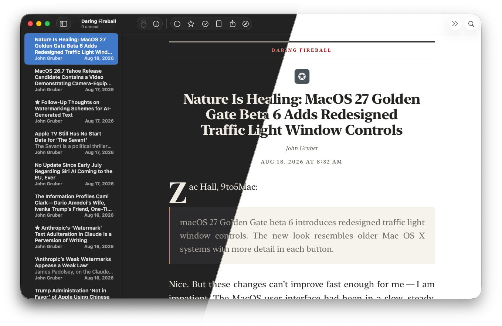

# New York Nightside



A theme for [NetNewsWire](https://netnewswire.com) that sets articles like a
broadsheet and finishes them like a Mac app.

Set in Apple's [**New York**](https://developer.apple.com/fonts/) throughout,
with a thick-over-thin press rule at the masthead, the feed name in letterspaced
caps, a drop cap on the opening paragraph, justified body copy with automatic
hyphenation, and a fleuron (❦) in place of the usual horizontal rule. The macOS
half shows up in the details: softly rounded media and code blocks, a
pill-shaped source link at the foot, and system-blue links.

Longer articles get an estimated reading time in the dateline. Narrow columns
on iPhone and in Split View switch to ragged-right text, and the theme respects
the system's Increase Contrast setting. See [CHANGELOG.md](CHANGELOG.md) for
what's new in each release.

Built dark-first. Both palettes are tuned to sit flush against NetNewsWire's own
window colors, so the reading pane doesn't float on a different shade from the
timeline beside it.

## Install

**iPhone and iPad:** GitHub won't render `netnewswire://` links as clickable, so
copy the full URL below, paste it into Safari's address bar, and confirm that you
want to open NetNewsWire. NetNewsWire then downloads and installs the theme.

```text
netnewswire://theme/add?url=https%3A%2F%2Fgithub.com%2Fchrislockard%2FNewYorkNightside%2Freleases%2Flatest%2Fdownload%2FNewYorkNightside.nnwtheme.zip
```

**macOS:** paste the same URL into Safari, or run it from Terminal:

```sh
open 'netnewswire://theme/add?url=https%3A%2F%2Fgithub.com%2Fchrislockard%2FNewYorkNightside%2Freleases%2Flatest%2Fdownload%2FNewYorkNightside.nnwtheme.zip'
```

**Manually:** download
[NewYorkNightside.nnwtheme.zip](https://github.com/chrislockard/NewYorkNightside/releases/latest/download/NewYorkNightside.nnwtheme.zip)
from the latest release and unzip it, then in NetNewsWire go to **Settings → Open Themes Folder** and drop it in. On iOS, save the bundle somewhere reachable from the Files app, then **Settings → Theme → +**.

Select it under **Settings → General → Article Theme** on macOS, or **Settings → Articles → Theme** on iOS.

## Notes before you install

- **Dark mode is the primary design.** Light mode is fully supported and tuned,
  but the theme was drawn for dark first and looks its best there.
- **Wants a recent macOS.** The rule that hides the empty headline on untitled
  items uses the CSS `:has()` selector, which needs Safari 15.4 or later. On
  older systems, untitled items will show an empty gap where the headline would
  be. Everything else degrades cleanly.
- The drop cap goes on the first real paragraph, wherever the feed puts it.
  Short items (under about 80 words) and posts that open with an image,
  heading or quote don't get one. That's deliberate: a drop cap floating beside
  a photo looks like a mistake. An all-italic editor's note at the top is
  skipped, and the drop cap goes on the paragraph after it.

## Tweaking it

Everything lives in `stylesheet.css`. The colors are CSS custom properties at
the top of the file, split into a light block and a `prefers-color-scheme: dark`
block, so retheming means editing about a dozen lines rather than hunting
through selectors.

Common changes:

| Want | Do this |
| --- | --- |
| Ragged-right instead of justified | Delete the `text-align: justify` line in `.articleBody p` (it's commented) |
| No drop cap | Delete the `#bodyContainer .dropCap::first-letter` rule |
| A different serif | Change `--font-serif` at the top |
| Wider or narrower measure | Change `max-width` on `body` (currently `40em`) |

## Palettes

| | Dark | Light |
| --- | --- | --- |
| Background | `#222222` | `#ffffff` |
| Body text | `#f1ece3` | `#252320` |
| Muted text | `#ada79f` | `#716c62` |
| Rules | `#3e3c37` | `#e1dcd1` |
| Links | `#8ab6ff` | `#0b5edf` |
| Masthead flag | `#e0736a` | `#b1221c` |

Both palettes hold roughly the same text contrast (about 13.5:1 dark, 15.7:1 light), so neither mode reads noticeably heavier than the other.

## Feedback

New York Nightside is actively maintained. If an article renders badly or
something looks off, please
[open an issue](https://github.com/chrislockard/NewYorkNightside/issues/new).
Include a link to the feed or article, your NetNewsWire and OS versions, light
or dark mode, and a screenshot if you can. Suggestions are welcome too.

If the same problem shows up in NetNewsWire's built-in themes, it's probably a
NetNewsWire issue. Report it to
[the NetNewsWire project](https://github.com/Ranchero-Software/NetNewsWire/issues) instead.

## License

MIT. See [LICENSE](LICENSE), which also carries attributions for NetNewsWire's
default theme (MIT, Ranchero Software) and the Font Awesome icon used in
`template.html` (CC BY 4.0).
